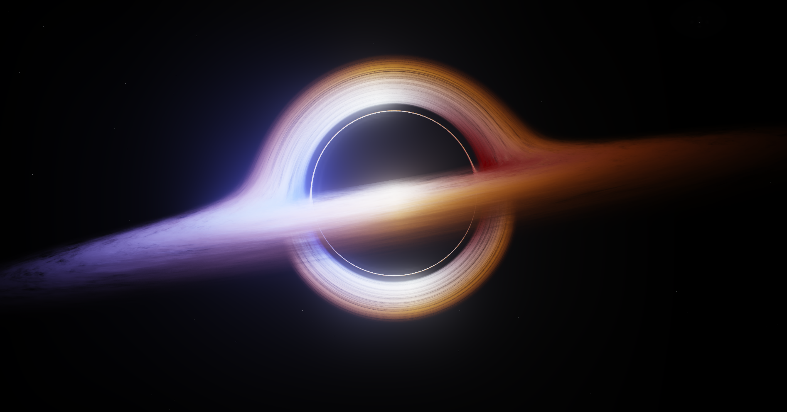
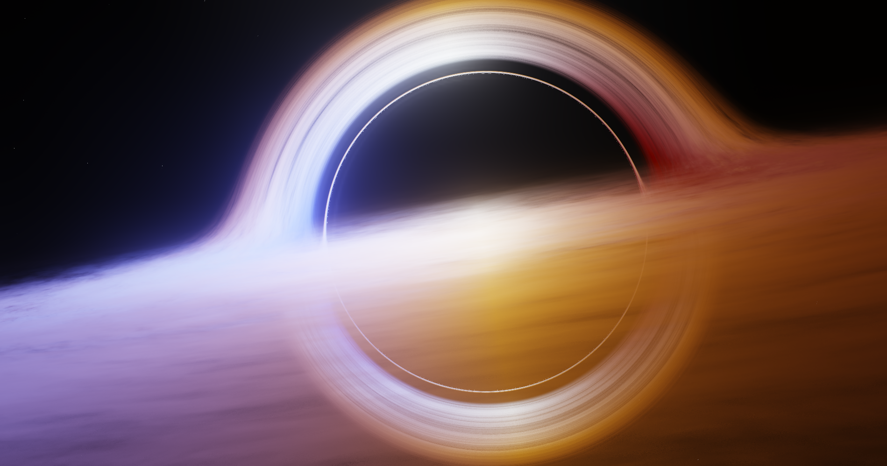
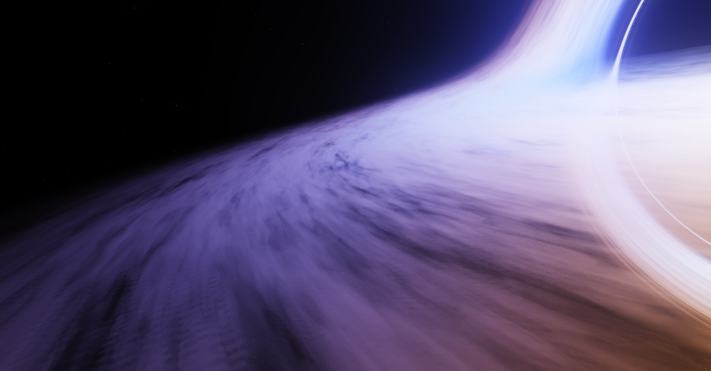

# Blackhole Ray Tracing - 黑洞引力透镜与吸积盘实时渲染

基于 OpenGL 4.6 的黑洞引力透镜效应实时渲染项目。通过在 GPU 片段着色器中对每个像素进行光线追踪（Ray Tracing），模拟光线在黑洞引力场中的弯曲，实现引力透镜、吸积盘、事件视界等视觉效果。

## 效果预览






## 环境要求

| 依赖 | 版本要求 | 说明 |
|------|---------|------|
| **操作系统** | Windows 10/11 x64 | 项目使用 MSVC 编译，仅支持 Windows |
| **GPU** | 支持 OpenGL 4.6 | 着色器使用 `#version 460 core` |
| **显卡驱动** | 最新版 | 需确保驱动支持 OpenGL 4.6 |
| **Visual Studio** | 2022 (v143 工具集) | 需安装"使用 C++ 的桌面开发"工作负载 |
| **CMake** | ≥ 3.12 | VS 2022 内置 CMake 支持即可 |
| **Ninja** | — | VS 2022 安装 CMake 工具时自动附带 |


## 第三方依赖

| 库 | 说明 |
|----|------|
| **GLFW 3.x** | 窗口创建、输入事件处理（静态链接） |
| **GLAD 0.1.36** | OpenGL 4.6 函数加载器 |
| **GLM** | 数学库（向量、矩阵、变换） |
| **Assimp (vc143-mtd)** | 3D 模型加载（MSVC 2022 Debug 静态库） |
| **Poly2Tri** | Assimp 的三角化依赖 |
| **stb_image** | 图像加载（PNG/JPG/HDR，单头文件） |

> `thirdParty/` 目录未包含在仓库中，请从以下网盘链接下载并解压到项目根目录：
>
> - 链接: https://pan.baidu.com/s/14YmyhhGvMOwN_FhNLv2f5A?pwd=1111
> - 提取码: `1111`
>
> 解压后确保目录结构为 `openGL_Material_blackhole/thirdParty/include/` 和 `openGL_Material_blackhole/thirdParty/lib/`。

- 

## 构建步骤

### 方式一：Visual Studio 2022（推荐）

1. 确保已安装 Visual Studio 2022，并勾选以下组件：
   - "使用 C++ 的桌面开发" 工作负载
   - CMake 工具（包含 Ninja）
2. 打开 Visual Studio 2022
3. 选择 **"打开本地文件夹"**，选择本项目根目录
4. VS 会自动识别 CMake 配置，等待配置完成
5. 选择 **x64-Debug** 配置
6. 点击 **生成 → 全部生成**（或 `Ctrl+Shift+B`）
7. 运行项目（`F5` 或 `Ctrl+F5`）

### 方式二：命令行构建

在 **VS 2022 开发者命令提示符** 中执行：

```bash
cd /d <项目路径>
cmake -B out/build/x64-Debug -G Ninja
cmake --build out/build/x64-Debug
```

构建完成后，可执行文件位于 `out/build/x64-Debug/openGLstudy.exe`。

### 注意事项

- **Assimp DLL**：CMake 配置了构建后复制 `assimp-vc143-mtd.dll` 到输出目录。如果该 DLL 不存在，构建后步骤可能报错。由于当前 `main.cpp` 未实际使用 Assimp 加载模型，此问题不影响运行，但需要确认 DLL 是否就位。
- **资源文件**：CMake 配置了自动将 `assets/` 目录复制到构建输出目录，确保着色器和 HDR 贴图可被正确加载。


| 技术 | 说明 |
|------|------|
| **光线追踪** | 从每个像素反投影出世界射线，最多迭代 500 步 |
| **牛顿引力加速** | `acceleration()` 函数模拟 `GM/r²` 引力场 |
| **RK4 积分** | 四阶 Runge-Kutta 数值积分更新光线方向，提高精度 |
| **自适应步长** | 靠近黑洞时自动缩小步长，避免穿越事件视界 |
| **吸积盘求交** | 检测光线是否穿过 y=0 平面，线性插值精确定位 |
| **FBN 噪声** | 极坐标 + 旋臂扭曲 + 分形布朗运动生成气态纹理 |
| **前到后合成** | Front-to-back alpha compositing 叠加吸积盘颜色 |
| **环境贴图采样** | 未被吞噬的光线采样 CubeMap 作为背景 |
| **Reinhard Tone Mapping** | `color / (color + 1.0)` |
| **Gamma 校正** | `pow(color, 1/2.2)` |


## 许可证

本项目仅供学习参考。
